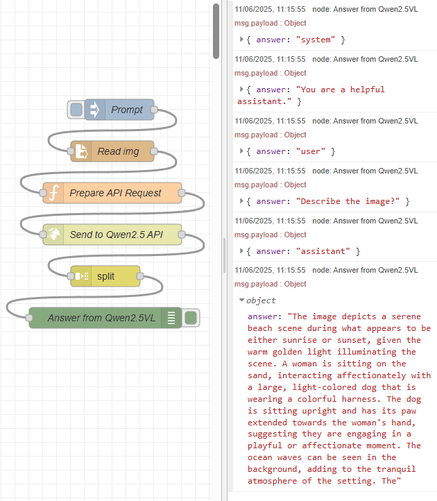

# FastAPI Server for Qwen 2.5 VL with OpenVINO
This repo implements a simple FastAPI server that can receive Qwen 2.5 VL inferencing requests from Node-Red.

## Setup
The following steps are based on the OpenVINO Notebook: https://github.com/openvinotoolkit/openvino_notebooks/blob/latest/notebooks/qwen2.5-vl/qwen2.5-vl.ipynb. Refer to the Notebook for more info.

First, install dependencies in a virtual env. The following also installs the <b>Qwen/Qwen2.5-VL-7B-Instruct</b> model and converts it to OpenVINO IR format. Edit the setup.py script to choose a different variant of the model.
```
# Create venv
python -m venv .venv
.\.venv\Scripts\activate
# Install dependencies, Qwen2.5VL model, and convert to IR format.
python setup.py
```

## Run Server
```
uvicorn qwen_vl_api_prod:app --host 0.0.0.0 --port 8000
```

## Node-Red Client
Install and start Node-Red, then import the flow: <b>node_red_flow.json</b>.
You can now request inferencing from Node-Red. Make sure to change the image path and prompt.

